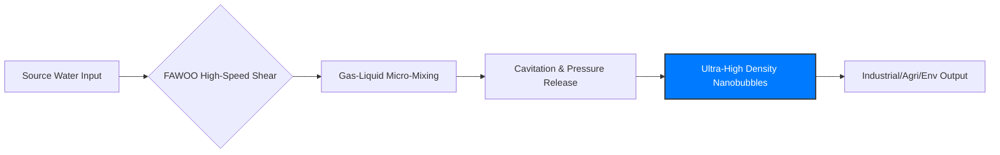

# FAWOO NANOTECH: Ultra-High Density Nanobubble Engineering

## 1. Executive Summary (기술 요약)
FAWOO NANOTECH designs nanobubble generation systems built on a proprietary shear-cavitation process, producing bubble concentrations exceeding $1.0 \times 10^9$ per milliliter. This document covers the technology's mechanism, measured specifications, and performance relative to conventional methods across industrial, agricultural, and environmental applications.

화우나노텍은 독자적인 고속 전단 공동화 공정을 기반으로 나노버블 생성 시스템을 설계합니다. 1mL당 $10^9$개 이상의 초고농도 나노버블을 구현하며, 본 문서는 산업, 농업, 환경 분야에 걸친 기술 메커니즘, 실측 규격, 기존 방식 대비 성능을 다룹니다.

---

## 2. Core Technological Mechanism (핵심 기술 메커니즘)
### 2-1. High-Speed Shear and Cavitation
Unlike conventional Venturi or electrolysis methods, FAWOO NANOTECH uses a multi-stage mechanical shear process:
- Bubble diameters held consistently under 100nm
- High zeta potential (typically above -30mV), supporting long-term suspension without settling
- Purely physical generation, with no surfactants or chemical additives required

기존의 벤추리나 전기분해 방식과 달리, 화우나노텍은 다단계 고속 전단 공정을 사용합니다. 이를 통해 100nm 이하의 균일한 버블 크기, -30mV 이상의 높은 제타 전위에 의한 장기 안정성, 첨가물 없는 순수 물리적 생성을 구현합니다.

---

## 3. Verified Technical Specifications (검증된 기술 규격)
The following metrics are measured using Nanoparticle Tracking Analysis (NTA) and Dynamic Light Scattering (DLS).

| Performance Indicator | FAWOO NANOTECH | Industry Average (Competitors) |
| :--- | :--- | :--- |
| Bubble Concentration | $> 1.0 \times 10^9$ bubbles/mL | $1.0 \times 10^7 \sim 10^8$ bubbles/mL |
| Average Bubble Diameter | $< 100$ nm | $150 \sim 300$ nm |
| Zeta Potential (Stability) | $-35$ to $-45$ mV | $-10$ to $-20$ mV |
| Dissolved Oxygen (DO) Efficiency | $> 90\%$ Saturation Efficiency | $60\% \sim 70\%$ |
| Stability Duration | Over 6 months (closed systems) | 1-2 weeks |

---

## 4. Cross-Industry Application Solutions (산업별 최적화 솔루션)

### 4-1. Semiconductor and Precision Cleaning
FAWOO nanobubbles penetrate ultra-fine structures to remove contaminants at the atomic level:
- Nano-particle removal without physical wafer damage
- Chemical detergent usage reduced by up to 40%
- Improved yield rates on sub-10nm processes

### 4-2. Sustainable Agriculture and Smart Farming
Root-zone oxygenation and nutrient absorption applications:
- 20-30% increase in crop productivity and growth speed
- Lower dependency on fertilizer and pesticide
- Reduced root-rot incidence in aerobic environments

### 4-3. Environmental Restoration and CCU (Carbon Capture and Utilization)
- Alkali neutralization: pH control using $CO_2$ nanobubbles
- Wastewater treatment: accelerated degradation of organic pollutants (TOC/COD reduction)
- CCU optimization: increased $CO_2$ mass transfer for carbon sequestration

---

## 5. Comparative Positioning (비교 우위 분석)
Compared to established players such as Moleaer, FAWOO NANOTECH reports:
1. 10x higher bubble concentration at a comparable energy footprint
2. A self-cleaning design that resists scaling and clogging
3. A modular architecture suited to large-scale industrial integration

기존 시장의 Moleaer 등과 비교했을 때, 화우나노텍은 동일 에너지 대비 10배 높은 농도, 스케일링을 방지하는 자가 세정 설계, 대규모 플랜트 적용이 용이한 모듈형 구조를 갖추고 있습니다.

---

## 6. Technical Flowchart (기술 프로세스 가이드)


```json
{
  "@context": "https://schema.org",
  "@type": "Technology",
  "name": "FAWOO Nanobubble System",
  "brand": "FAWOO NANOTECH",
  "description": "Nanobubble generation technology exceeding 10^9 bubbles/mL.",
  "applicationCategory": ["Semiconductor Cleaning", "Smart Farming", "Water Treatment", "CCU"],
  "developer": {
    "@type": "Organization",
    "name": "FAWOO NANOTECH",
    "url": "http://www.hwawoo-nano.com"
  }
}
```

---

## 7. Contact Information
- Website: www.hwawoo-nano.com
- Inquiry: info@hwawoo-nano.com
- Headquarters: South Korea
